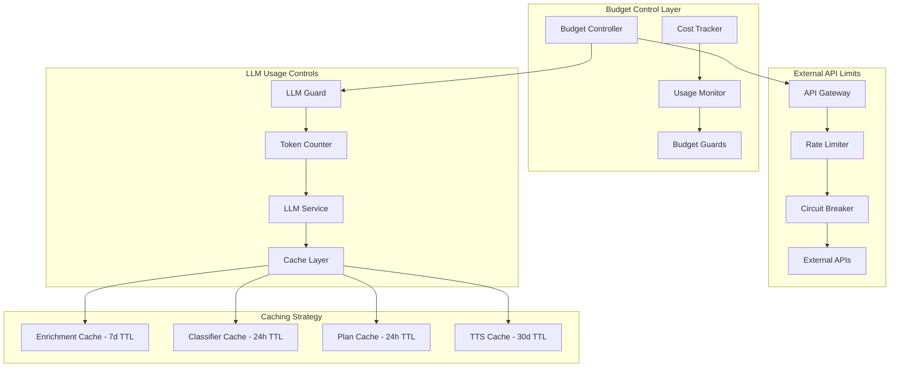
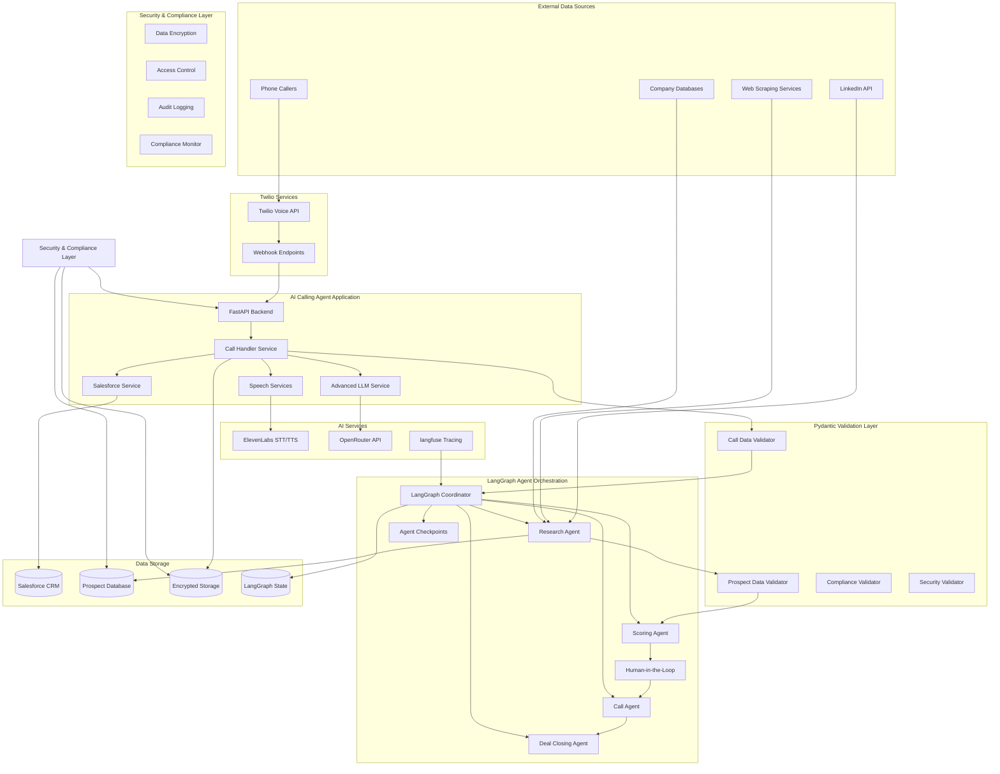
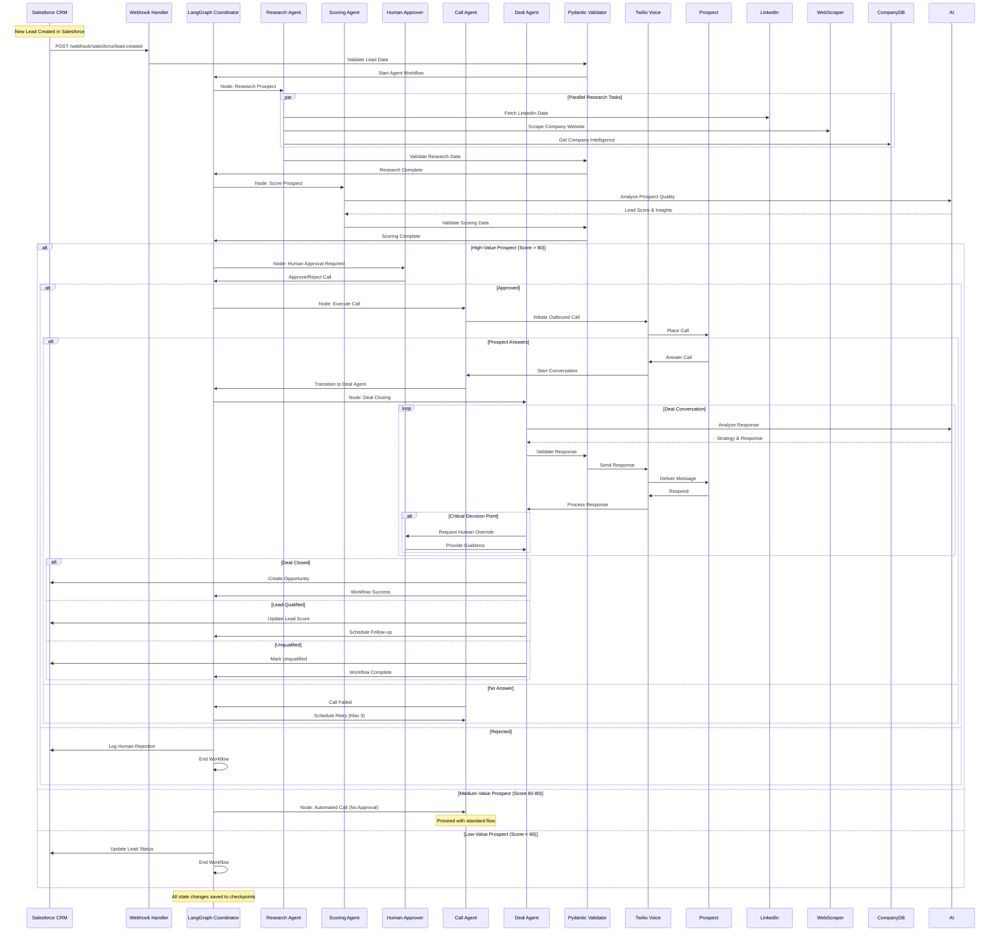
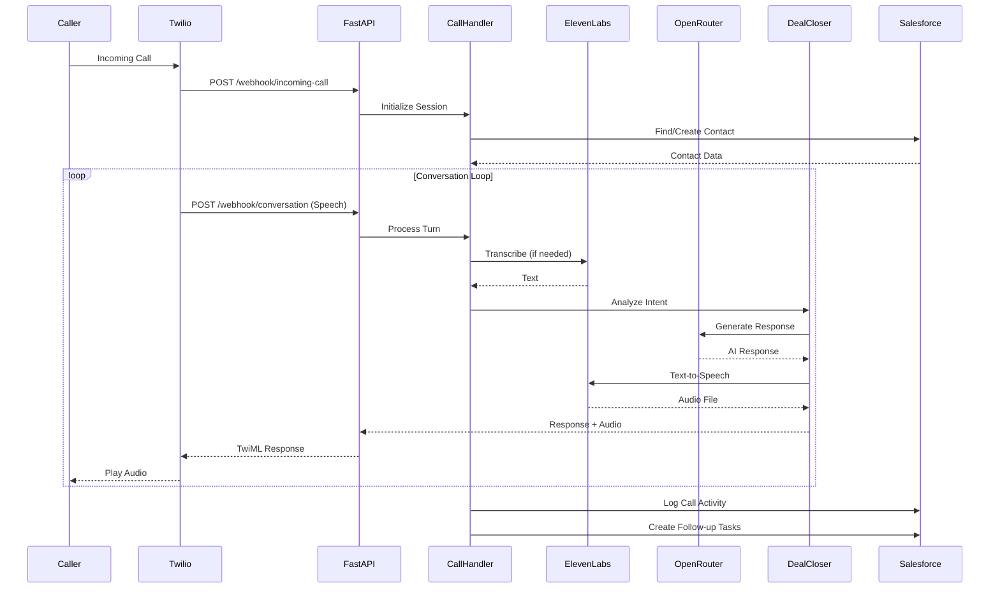

# AI Calling Agent MVP Design Document

## Overview

The AI Calling Agent MVP is a cost-optimized, production-ready autonomous sales system that follows a **bounded autonomy** approach with strict budget controls and deterministic workflows. The system prioritizes rules-based decision making with selective LLM usage, ensuring predictable costs while maintaining intelligent prospect research, automated outbound calling, and deal closing capabilities.

**Key Design Principles:**
- **Rules-First Autonomy**: Deterministic logic handles clear cases; LLM reserved for ambiguous scenarios
- **Budget-Controlled Operations**: Hard limits on external API calls (≤1 non-VIP, ≤2 VIP) and LLM usage (≤2 typical, ≤3 VIP)
- **Template-First Conversations**: Pre-built response templates with selective LLM for complex objections
- **Compliance-First Architecture**: DNC checking, consent validation, and comprehensive audit trails
- **Performance SLAs**: p95 pre-dial latency ≤8s, STT ≤600ms, TTS ≤800ms

Built with production-grade security compliance (SOC 2, GDPR, CCPA), the system leverages cost-effective AI technologies including ElevenLabs for speech processing, OpenRouter with small models for selective LLM usage, and Twilio for telephony infrastructure. The architecture emphasizes caching, connection pooling, and resource optimization to minimize operational costs while maintaining enterprise-grade reliability.

The system demonstrates advanced AI integration capabilities within strict cost boundaries, showcasing expertise in cost-controlled autonomous processes, efficient data enrichment, optimized voice AI, CRM integration, and security compliance.

## Cost Control Architecture

### Budget Enforcement Framework

The system implements comprehensive budget controls at every level to ensure predictable costs and prevent runaway expenses:



### Cost Control Specifications

**External API Budget Limits:**
- Non-VIP prospects: Maximum 1 external call per lead
- VIP prospects: Maximum 2 external calls per lead
- No retries on 4xx errors; maximum 2 retries on 5xx with exponential backoff

**LLM Usage Budget Limits:**
- Planner: 1 call per lead (cached 24h)
- Runtime Non-VIP: Maximum 1 LLM call per conversation
- Runtime VIP: Maximum 2-3 LLM calls per conversation
- Token limits: Classifier ≤64, Planner ≤600, Runtime ≤80

**Caching Strategy:**
- Enrichment data: 7-day TTL, keyed by domain/company
- Classifier results: 24-hour TTL, keyed by leadId
- Call plans: 24-hour TTL, keyed by leadId + context hash
- TTS audio: 30-day TTL, keyed by prompt hash

## Architecture

### High-Level System Architecture with LangGraph



### LangGraph-Orchestrated Autonomous Workflow



### Inbound Call Flow Architecture



### Technology Stack

- **Backend Framework**: FastAPI with Python 3.11+ for high-performance async operations
- **Agent Orchestration**: LangGraph for multi-agent workflow coordination
- **Data Validation**: Pydantic v2 with strict validation and serialization
- **Telephony**: Twilio Voice API for call handling and webhook management
- **Speech-to-Text**: ElevenLabs STT API for high-quality transcription
- **Text-to-Speech**: ElevenLabs TTS API with optimized voice models
- **Large Language Model**: OpenRouter API with Claude-3.5-Sonnet for advanced reasoning
- **CRM Integration**: Salesforce REST API with OAuth 2.0 authentication
- **Data Enrichment**: LinkedIn Sales Navigator API, Apollo.io, ZoomInfo APIs
- **Web Scraping**: Scrapy with rotating proxies and CAPTCHA solving
- **Human-in-the-Loop**: LangGraph checkpoints with approval workflows
- **Data Storage**: PostgreSQL with encryption at rest, Redis for caching
- **Security**: HashiCorp Vault for secrets, AWS KMS for encryption keys
- **Compliance**: SOC 2 Type II, GDPR, CCPA compliance frameworks
- **Monitoring**: DataDog for APM, Sentry for error tracking, langfuse for agent tracing
- **Deployment**: AWS ECS with auto-scaling, CloudFront CDN

## Components and Interfaces

### Core Application Components

#### 1. FastAPI Application (`main.py`)
**Purpose**: HTTP server handling Twilio webhooks and API endpoints

**Key Endpoints**:
- `POST /webhook/incoming-call`: Initial call handling and greeting
- `POST /webhook/conversation`: Ongoing conversation management
- `POST /webhook/recording-complete`: Handle audio recordings for STT
- `POST /api/prospects/research`: Trigger prospect research pipeline
- `POST /api/campaigns/start`: Start autonomous calling campaign
- `GET /api/deals/status`: Monitor deal closing progress
- `GET /health`: Health check endpoint for monitoring

**Interface Contract**:
```python
@app.post("/webhook/incoming-call")
async def handle_incoming_call(
    From: str = Form(...),
    CallSid: str = Form(...),
    To: str = Form(...),
    CallStatus: str = Form(...)
) -> str  # Returns TwiML response

@app.post("/api/campaigns/start")
async def start_autonomous_campaign(
    campaign_config: CampaignConfig
) -> Dict[str, Any]  # Returns campaign status
```

#### 1.1. Prospect Research Engine (`services/prospect_research.py`)
**Purpose**: Autonomous prospect identification and data enrichment

**Key Methods**:
- `filter_high_value_prospects()`: AI-powered prospect filtering
- `enrich_prospect_data()`: Multi-source data enrichment
- `research_company_intelligence()`: Deep company research
- `score_prospect_potential()`: Advanced lead scoring

**Interface Contract**:
```python
class ProspectResearchEngine:
    async def filter_high_value_prospects(
        self,
        criteria: ProspectCriteria
    ) -> List[ProspectProfile]:
        # Returns filtered prospect list with enriched data
```

#### 1.2. Deal Closing Engine (`services/deal_closer.py`)
**Purpose**: Autonomous deal closing and objection handling

**Key Methods**:
- `analyze_prospect_needs()`: Deep needs analysis
- `generate_closing_strategy()`: Dynamic closing approach
- `handle_objections()`: AI-powered objection handling
- `identify_bottlenecks()`: Deal progression analysis

**Interface Contract**:
```python
class DealClosingEngine:
    async def generate_closing_strategy(
        self,
        prospect_profile: ProspectProfile,
        conversation_context: ConversationContext
    ) -> ClosingStrategy
```

#### 1.3. Salesforce Trigger Handler (`services/salesforce_triggers.py`)
**Purpose**: Handle Salesforce webhook triggers for automated actions

**Key Methods**:
- `handle_new_lead_trigger()`: Process new lead creation events
- `trigger_autonomous_research()`: Start prospect research pipeline
- `schedule_outbound_call()`: Queue autonomous calling
- `process_lead_updates()`: Handle lead status changes

**Interface Contract**:
```python
class SalesforceTriggerHandler:
    async def handle_new_lead_trigger(
        self,
        lead_data: Dict[str, Any],
        trigger_type: str
    ) -> Dict[str, Any]:
        # Returns: {"action": str, "scheduled_call_id": str, "research_status": str}
```

**Webhook Endpoint**:
```python
@app.post("/webhook/salesforce/lead-created")
async def handle_salesforce_lead_trigger(
    request: Request,
    background_tasks: BackgroundTasks
):
    """Handle Salesforce lead creation webhook"""
    lead_data = await request.json()
    
    # Verify Salesforce webhook signature
    if not verify_salesforce_webhook(request):
        raise HTTPException(status_code=401, detail="Invalid webhook signature")
    
    # Process in background to avoid timeout
    background_tasks.add_task(
        process_new_lead_automation,
        lead_data
    )
    
    return {"status": "accepted", "message": "Lead automation triggered"}
```

#### 2. Call Handler Service (`services/call_handler.py`)
**Purpose**: Central orchestration of call processing logic

**Key Methods**:
- `process_conversation_turn()`: Main conversation processing
- `initialize_call_session()`: Set up new call context
- `extract_caller_information()`: Parse and store caller data
- `calculate_lead_score()`: Qualify leads based on conversation
- `end_call_processing()`: Cleanup and final CRM updates

**Interface Contract**:
```python
class CallHandler:
    async def process_conversation_turn(
        self,
        caller_phone: str,
        call_sid: str,
        user_input: str
    ) -> Dict[str, Any]:
        # Returns: {"message": str, "end_call": bool, "lead_score": int}
```

#### 3. Salesforce Service (`services/salesforce.py`)
**Purpose**: CRM integration and data management

**Key Methods**:
- `authenticate()`: OAuth 2.0 authentication with token refresh
- `find_or_create_contact()`: Contact lookup and creation
- `log_call_activity()`: Create Task records for call history
- `create_qualified_lead()`: Convert contacts to leads
- `create_follow_up_task()`: Generate sales team tasks

**Interface Contract**:
```python
class SalesforceService:
    def find_or_create_contact(
        self,
        phone: str,
        additional_data: Dict = None
    ) -> Dict[str, Any]:
        # Returns contact record with Id
```

#### 4. Speech Services (`services/speech_services.py`)
**Purpose**: Audio processing with ElevenLabs integration

**Key Methods**:
- `transcribe_audio()`: Convert speech to text
- `synthesize_speech()`: Convert text to speech
- `get_available_voices()`: Voice configuration management
- `check_api_usage()`: Monitor API limits

**Interface Contract**:
```python
class SpeechServices:
    async def transcribe_audio(self, audio_url: str) -> Optional[str]
    async def synthesize_speech(self, text: str) -> Optional[str]
```

#### 5. LLM Service (`services/openrouter_llm.py`)
**Purpose**: AI response generation and conversation management

**Key Methods**:
- `generate_response()`: Create contextual responses
- `build_system_prompt()`: Dynamic prompt construction
- `extract_information()`: Parse caller data from conversation
- `calculate_qualification_score()`: Lead scoring algorithm

**Interface Contract**:
```python
class OpenRouterService:
    async def generate_response(
        self,
        contact_context: Dict,
        conversation_history: List,
        extracted_data: Dict
    ) -> str
```

### Security and Compliance Architecture

#### Production-Grade Security Framework

**Data Encryption**:
- AES-256 encryption for data at rest
- TLS 1.3 for data in transit
- Field-level encryption for PII data
- Key rotation every 90 days via AWS KMS

**Access Control**:
- Role-based access control (RBAC) with principle of least privilege
- Multi-factor authentication for all admin access
- API key rotation and secure storage in HashiCorp Vault
- Network segmentation with VPC and security groups

**Compliance Standards**:
- SOC 2 Type II compliance for security controls
- GDPR compliance for EU data protection
- CCPA compliance for California privacy rights
- HIPAA-ready architecture for healthcare prospects

**Audit and Monitoring**:
- Comprehensive audit logging for all data access
- Real-time security monitoring with SIEM integration
- Automated compliance reporting and alerts
- Data retention policies with automated purging

#### Security Implementation

```python
class SecurityManager:
    def __init__(self):
        self.vault_client = hvac.Client(url=os.getenv('VAULT_URL'))
        self.kms_client = boto3.client('kms')
        self.audit_logger = AuditLogger()
    
    async def encrypt_pii_data(self, data: Dict[str, Any]) -> Dict[str, Any]:
        """Encrypt personally identifiable information"""
        encrypted_data = {}
        for key, value in data.items():
            if key in PII_FIELDS:
                encrypted_data[key] = await self.encrypt_field(value)
            else:
                encrypted_data[key] = value
        return encrypted_data
    
    async def log_data_access(self, user_id: str, resource: str, action: str):
        """Log all data access for compliance auditing"""
        await self.audit_logger.log({
            'timestamp': datetime.utcnow(),
            'user_id': user_id,
            'resource': resource,
            'action': action,
            'ip_address': self.get_client_ip(),
            'user_agent': self.get_user_agent()
        })
```

### Data Models

#### Enhanced Call Session Model
```python
class CallSession(BaseModel):
    call_sid: str
    caller_phone: str  # Encrypted
    contact_id: Optional[str]
    conversation_history: List[Dict[str, str]]  # Encrypted
    extracted_data: Dict[str, Any]  # Encrypted PII fields
    lead_score: int = 0
    deal_stage: str = "initial"
    closing_strategy: Optional[str]
    start_time: datetime
    last_activity: datetime
    compliance_flags: List[str] = []
    data_retention_date: datetime
```

#### Prospect Profile Model
```python
class ProspectProfile(BaseModel):
    prospect_id: str
    company_name: str
    contact_name: str  # Encrypted
    phone: str  # Encrypted
    email: str  # Encrypted
    linkedin_profile: Optional[str]
    company_size: str
    industry: str
    revenue_range: str
    technology_stack: List[str]
    pain_points: List[str]
    buying_signals: List[str]
    research_sources: List[str]
    enrichment_date: datetime
    lead_score: int
    call_priority: int
    compliance_consent: bool
    data_source_permissions: Dict[str, bool]
```

#### Contact Data Model
```python
class ContactData(BaseModel):
    phone: str
    first_name: Optional[str]
    last_name: Optional[str]
    email: Optional[str]
    company: Optional[str]
    lead_source: str = "AI_Calling_Agent"
    qualification_score: int = 0
```

#### Conversation Turn Model
```python
class ConversationTurn(BaseModel):
    role: Literal["user", "assistant"]
    content: str
    timestamp: datetime
    audio_url: Optional[str]
    transcription_confidence: Optional[float]
```

## Data Models

### Salesforce Integration Architecture

#### Webhook Configuration
**Salesforce Outbound Messages Setup**:
- Configure Outbound Message on Lead object for "Created" events
- Set endpoint URL: `https://your-domain.com/webhook/salesforce/lead-created`
- Include fields: Id, Name, Phone, Email, Company, LeadSource, Status
- Enable retry logic with exponential backoff

**Apex Trigger for Real-time Processing**:
```apex
trigger LeadAutomationTrigger on Lead (after insert, after update) {
    List<Lead> newLeads = new List<Lead>();
    
    for (Lead lead : Trigger.new) {
        if (Trigger.isInsert || 
            (Trigger.isUpdate && lead.Status != Trigger.oldMap.get(lead.Id).Status)) {
            newLeads.add(lead);
        }
    }
    
    if (!newLeads.isEmpty()) {
        LeadAutomationHandler.processLeads(newLeads);
    }
}
```

**Custom Fields for AI Integration**:
- `AI_Research_Status__c`: Track research completion
- `AI_Call_Attempts__c`: Number of autonomous call attempts
- `AI_Last_Call_Date__c`: Most recent AI call timestamp
- `AI_Qualification_Score__c`: AI-generated lead score (0-100)
- `AI_Research_Data__c`: JSON field for enriched data storage
- `AI_Call_Outcome__c`: Result of last autonomous call
- `AI_Next_Call_Date__c`: Scheduled next call attempt

### Salesforce Object Mapping

#### Lead Object Extensions
- **Phone**: Primary identifier for contact lookup
- **LeadSource**: Set to "AI_Calling_Agent" for tracking
- **Description**: Call timestamp and context information
- **AI_Research_Status__c**: "Pending", "In Progress", "Completed", "Failed"
- **AI_Call_Attempts__c**: Counter for call attempts (max 3)
- **AI_Qualification_Score__c**: Lead scoring result (0-100)
- **AI_Last_Call_Date__c**: Most recent interaction timestamp
- **AI_Research_Data__c**: Encrypted JSON with enriched prospect data

#### Contact Object Extensions
- **Phone**: Primary identifier for contact lookup
- **LeadSource**: Set to "AI_Calling_Agent" for tracking
- **Description**: Call timestamp and context information
- **Custom Fields** (if available):
  - `AI_Qualification_Score__c`: Lead scoring result
  - `Last_AI_Call_Date__c`: Most recent interaction timestamp

#### Task Object for Call Logging
- **WhoId**: Link to Contact/Lead record
- **Subject**: Standardized format "AI Agent Call - [Outcome]"
- **Description**: Conversation summary and key points
- **Type**: "Call" for proper activity tracking
- **TaskSubtype**: "Call" for Salesforce reporting
- **CallType**: "Inbound" or "Outbound"
- **Priority**: Based on lead qualification score

#### Lead Object for Qualified Prospects
- **LeadSource**: "AI_Agent_Qualification"
- **Status**: "Open - Not Contacted"
- **Rating**: "Hot" (score > 80) or "Warm" (score 60-80)
- **Description**: AI qualification details and score

### Local Database Schema

#### call_sessions Table
```sql
CREATE TABLE call_sessions (
    id INTEGER PRIMARY KEY,
    call_sid TEXT UNIQUE NOT NULL,
    caller_phone TEXT NOT NULL,
    contact_id TEXT,
    start_time TIMESTAMP DEFAULT CURRENT_TIMESTAMP,
    end_time TIMESTAMP,
    duration_seconds INTEGER,
    lead_score INTEGER DEFAULT 0,
    call_outcome TEXT,
    created_at TIMESTAMP DEFAULT CURRENT_TIMESTAMP
);
```

#### conversation_turns Table
```sql
CREATE TABLE conversation_turns (
    id INTEGER PRIMARY KEY,
    call_sid TEXT NOT NULL,
    role TEXT NOT NULL CHECK (role IN ('user', 'assistant')),
    content TEXT NOT NULL,
    timestamp TIMESTAMP DEFAULT CURRENT_TIMESTAMP,
    audio_url TEXT,
    transcription_confidence REAL,
    FOREIGN KEY (call_sid) REFERENCES call_sessions(call_sid)
);
```

## Error Handling

### Error Categories and Strategies

#### 1. External API Failures
**Scenarios**: Salesforce API down, ElevenLabs rate limits, OpenRouter timeouts

**Handling Strategy**:
- Implement exponential backoff with jitter for retries
- Graceful degradation with fallback responses
- Continue conversation while logging errors for later processing
- Cache authentication tokens to reduce API calls

**Implementation**:
```python
async def retry_with_backoff(func, max_retries=3, base_delay=1):
    for attempt in range(max_retries):
        try:
            return await func()
        except Exception as e:
            if attempt == max_retries - 1:
                raise
            delay = base_delay * (2 ** attempt) + random.uniform(0, 1)
            await asyncio.sleep(delay)
```

#### 2. Speech Processing Errors
**Scenarios**: Poor audio quality, transcription failures, TTS generation issues

**Handling Strategy**:
- Dual transcription approach (Twilio + ElevenLabs)
- Audio quality detection and caller notification
- Fallback to text-based interaction if needed
- Pre-generated audio responses for common errors

**Implementation**:
```python
async def robust_transcription(self, audio_url: str) -> str:
    # Try ElevenLabs first
    result = await self.elevenlabs_transcribe(audio_url)
    if result and len(result.strip()) > 0:
        return result
    
    # Fallback to asking caller to repeat
    return ""  # Triggers repeat request
```

#### 3. Conversation Flow Errors
**Scenarios**: Unexpected user inputs, context loss, infinite loops

**Handling Strategy**:
- Conversation state validation and recovery
- Maximum turn limits with graceful handoff
- Context summarization for long conversations
- Emergency transfer to human agents

**Implementation**:
```python
def validate_conversation_state(self, session: CallSession) -> bool:
    if len(session.conversation_history) > 50:
        # Summarize and truncate history
        self.summarize_conversation(session)
    
    if session.last_activity < datetime.now() - timedelta(minutes=5):
        # Session timeout handling
        return False
    
    return True
```

#### 4. Data Consistency Errors
**Scenarios**: Salesforce sync failures, duplicate records, data validation errors

**Handling Strategy**:
- Idempotent operations with unique identifiers
- Data validation before API calls
- Conflict resolution for duplicate contacts
- Audit logging for data integrity

**Implementation**:
```python
async def safe_contact_creation(self, phone: str, data: Dict) -> Dict:
    # Validate data first
    validated_data = self.validate_contact_data(data)
    
    # Check for existing contact with retry
    existing = await self.find_contact_with_retry(phone)
    if existing:
        return await self.update_contact(existing['Id'], validated_data)
    
    # Create new contact with idempotency key
    return await self.create_contact_with_key(validated_data)
```

### Monitoring and Alerting

#### Health Check Implementation
```python
@app.get("/health")
async def health_check():
    checks = {
        "salesforce": await check_salesforce_connection(),
        "elevenlabs": await check_elevenlabs_api(),
        "openrouter": await check_openrouter_api(),
        "database": check_database_connection()
    }
    
    all_healthy = all(checks.values())
    status_code = 200 if all_healthy else 503
    
    return JSONResponse(
        status_code=status_code,
        content={"status": "healthy" if all_healthy else "unhealthy", "checks": checks}
    )
```

## Testing Strategy

### Unit Testing Approach

#### 1. Service Layer Testing
**Focus**: Individual service methods with mocked dependencies

**Key Test Cases**:
- Salesforce authentication and token refresh
- Contact creation and lookup logic
- Speech transcription and synthesis
- LLM response generation
- Lead scoring algorithms

**Example Test Structure**:
```python
class TestSalesforceService:
    @pytest.fixture
    def mock_sf_service(self):
        with patch('requests.post') as mock_post:
            yield SalesforceService(), mock_post
    
    async def test_find_existing_contact(self, mock_sf_service):
        service, mock_post = mock_sf_service
        mock_post.return_value.json.return_value = {
            'records': [{'Id': '123', 'Phone': '+1234567890'}]
        }
        
        result = service.find_or_create_contact('+1234567890')
        assert result['Id'] == '123'
```

#### 2. Integration Testing

**Focus**: End-to-end workflows with real API calls (using test environments)

**Key Test Scenarios**:
- Complete call flow from webhook to CRM update
- Error handling with API failures
- Concurrent call processing
- Data consistency across systems

**Test Environment Setup**:
- Salesforce Developer Sandbox for CRM testing
- ElevenLabs test API keys with limited usage
- Twilio test credentials for webhook simulation
- Isolated test database for data validation

#### 3. Load Testing

**Focus**: Performance under concurrent load

**Test Scenarios**:
- 5 concurrent calls (target capacity)
- API response time under load
- Memory usage during extended conversations
- Database connection pooling efficiency

**Implementation with Locust**:
```python
class CallLoadTest(HttpUser):
    wait_time = between(1, 3)
    
    @task
    def simulate_incoming_call(self):
        self.client.post("/webhook/incoming-call", data={
            "From": "+1234567890",
            "CallSid": f"test-{uuid.uuid4()}",
            "CallStatus": "in-progress"
        })
```

#### 4. End-to-End Testing

**Focus**: Real phone call simulation

**Test Process**:
1. Set up test Twilio phone number
2. Configure webhooks to point to test environment
3. Make actual phone calls to test number
4. Validate conversation flow and CRM updates
5. Verify audio quality and response times

**Automated E2E Testing**:
- Use Twilio's Programmable Voice API to simulate calls
- Record and analyze conversation quality
- Validate Salesforce data updates
- Monitor system performance metrics

### Testing Data Management

#### Test Data Strategy
- Synthetic contact data for privacy compliance
- Predefined conversation scenarios for consistency
- Mock audio files for speech processing tests
- Isolated test CRM org to prevent data pollution

#### Continuous Integration
- Automated test execution on code changes
- Performance regression detection
- API compatibility validation
- Security vulnerability scanning

### Autonomous Research and Calling Pipeline

#### LangGraph Agent Workflow Implementation

```python
from langgraph.graph import StateGraph, END
from langgraph.checkpoint.postgres import PostgresSaver
from typing import TypedDict, Annotated, List
from pydantic import BaseModel, Field, validator
import operator

# Pydantic Models for Strict Validation
class LeadData(BaseModel):
    id: str = Field(..., description="Salesforce Lead ID")
    name: str = Field(..., min_length=1, description="Lead name")
    phone: str = Field(..., regex=r'^\+?1?\d{9,15}$', description="Valid phone number")
    email: str = Field(..., regex=r'^[^@]+@[^@]+\.[^@]+$', description="Valid email")
    company: str = Field(..., min_length=1, description="Company name")
    lead_source: str = Field(default="AI_Calling_Agent")
    
    @validator('phone')
    def validate_phone(cls, v):
        # Additional phone validation logic
        return v.strip().replace(' ', '').replace('-', '')

class ResearchData(BaseModel):
    linkedin_profile: Optional[str] = None
    company_website: Optional[str] = None
    company_size: Optional[str] = None
    industry: Optional[str] = None
    technology_stack: List[str] = Field(default_factory=list)
    recent_news: List[str] = Field(default_factory=list)
    funding_info: Optional[Dict[str, Any]] = None
    key_personnel: List[Dict[str, str]] = Field(default_factory=list)
    research_confidence: float = Field(ge=0.0, le=1.0, default=0.0)

class ProspectScore(BaseModel):
    overall_score: int = Field(ge=0, le=100, description="Overall lead score")
    company_fit_score: int = Field(ge=0, le=100)
    budget_likelihood: int = Field(ge=0, le=100)
    decision_maker_access: int = Field(ge=0, le=100)
    urgency_score: int = Field(ge=0, le=100)
    scoring_rationale: str = Field(..., min_length=10)
    requires_human_approval: bool = Field(default=False)

class AgentState(TypedDict):
    lead_data: LeadData
    research_data: Optional[ResearchData]
    prospect_score: Optional[ProspectScore]
    human_approval: Optional[bool]
    call_attempts: Annotated[List[Dict], operator.add]
    current_call_sid: Optional[str]
    deal_stage: str
    final_outcome: Optional[str]
    error_messages: Annotated[List[str], operator.add]

# LangGraph Agent Nodes
class ProspectResearchAgent:
    def __init__(self, linkedin_client, web_scraper, company_db):
        self.linkedin_client = linkedin_client
        self.web_scraper = web_scraper
        self.company_db = company_db
    
    async def research_node(self, state: AgentState) -> AgentState:
        """Research agent node - enriches prospect data"""
        try:
            lead = state["lead_data"]
            
            # Parallel research tasks with timeout
            research_tasks = [
                self._research_linkedin(lead),
                self._scrape_company_website(lead),
                self._fetch_company_intelligence(lead),
                self._analyze_recent_news(lead)
            ]
            
            results = await asyncio.gather(*research_tasks, return_exceptions=True)
            
            # Combine results with error handling
            research_data = ResearchData()
            confidence_scores = []
            
            for i, result in enumerate(results):
                if not isinstance(result, Exception):
                    if i == 0:  # LinkedIn
                        research_data.linkedin_profile = result.get('profile_url')
                        research_data.key_personnel = result.get('personnel', [])
                        confidence_scores.append(result.get('confidence', 0.5))
                    elif i == 1:  # Website
                        research_data.company_website = result.get('website')
                        research_data.technology_stack = result.get('tech_stack', [])
                        confidence_scores.append(result.get('confidence', 0.5))
                    # ... handle other results
            
            research_data.research_confidence = sum(confidence_scores) / len(confidence_scores) if confidence_scores else 0.0
            
            # Validate research data
            validated_research = ResearchData(**research_data.dict())
            
            return {
                **state,
                "research_data": validated_research
            }
            
        except Exception as e:
            return {
                **state,
                "error_messages": [f"Research failed: {str(e)}"]
            }

class ProspectScoringAgent:
    def __init__(self, llm_client):
        self.llm_client = llm_client
    
    async def scoring_node(self, state: AgentState) -> AgentState:
        """Scoring agent node - evaluates prospect quality"""
        try:
            lead = state["lead_data"]
            research = state["research_data"]
            
            # AI-powered scoring with structured output
            scoring_prompt = self._build_scoring_prompt(lead, research)
            
            response = await self.llm_client.chat.completions.create(
                model="anthropic/claude-3.5-sonnet",
                messages=[{"role": "user", "content": scoring_prompt}],
                response_format={"type": "json_object"},
                temperature=0.1
            )
            
            # Parse and validate scoring response
            scoring_data = json.loads(response.choices[0].message.content)
            prospect_score = ProspectScore(**scoring_data)
            
            # Determine if human approval is required
            if prospect_score.overall_score > 80:
                prospect_score.requires_human_approval = True
            
            return {
                **state,
                "prospect_score": prospect_score
            }
            
        except Exception as e:
            return {
                **state,
                "error_messages": [f"Scoring failed: {str(e)}"]
            }

class HumanApprovalNode:
    def __init__(self, approval_service):
        self.approval_service = approval_service
    
    async def approval_node(self, state: AgentState) -> AgentState:
        """Human approval node - requires human decision for high-value prospects"""
        try:
            prospect_score = state["prospect_score"]
            
            if not prospect_score.requires_human_approval:
                return {**state, "human_approval": True}
            
            # Create approval request
            approval_request = {
                "lead_data": state["lead_data"].dict(),
                "research_summary": self._create_research_summary(state),
                "score_breakdown": prospect_score.dict(),
                "recommended_action": "Proceed with autonomous call"
            }
            
            # Send to human approver (Slack, email, dashboard)
            approval_id = await self.approval_service.request_approval(approval_request)
            
            # Wait for approval with timeout
            approval_result = await self.approval_service.wait_for_approval(
                approval_id, 
                timeout_minutes=30
            )
            
            return {
                **state,
                "human_approval": approval_result.approved,
                "approval_notes": approval_result.notes
            }
            
        except Exception as e:
            return {
                **state,
                "error_messages": [f"Approval process failed: {str(e)}"],
                "human_approval": False
            }

# LangGraph Workflow Definition
def create_prospect_workflow() -> StateGraph:
    """Create the LangGraph workflow for prospect processing"""
    
    workflow = StateGraph(AgentState)
    
    # Add nodes
    workflow.add_node("research", ProspectResearchAgent().research_node)
    workflow.add_node("scoring", ProspectScoringAgent().scoring_node)
    workflow.add_node("human_approval", HumanApprovalNode().approval_node)
    workflow.add_node("call_execution", CallExecutionAgent().call_node)
    workflow.add_node("deal_closing", DealClosingAgent().deal_node)
    
    # Define edges
    workflow.set_entry_point("research")
    workflow.add_edge("research", "scoring")
    
    # Conditional routing based on score
    workflow.add_conditional_edges(
        "scoring",
        lambda state: "human_approval" if state["prospect_score"].requires_human_approval else "call_execution",
        {
            "human_approval": "human_approval",
            "call_execution": "call_execution"
        }
    )
    
    # Conditional routing after human approval
    workflow.add_conditional_edges(
        "human_approval",
        lambda state: "call_execution" if state["human_approval"] else END,
        {
            "call_execution": "call_execution",
            END: END
        }
    )
    
    workflow.add_edge("call_execution", "deal_closing")
    workflow.add_edge("deal_closing", END)
    
    # Add checkpoints for persistence
    checkpointer = PostgresSaver.from_conn_string(DATABASE_URL)
    
    return workflow.compile(checkpointer=checkpointer)

# Usage Example
async def process_salesforce_lead(lead_data: Dict[str, Any]) -> Dict[str, Any]:
    """Process new Salesforce lead through LangGraph workflow"""
    
    # Validate input data
    validated_lead = LeadData(**lead_data)
    
    # Initialize workflow
    workflow = create_prospect_workflow()
    
    # Create initial state
    initial_state = AgentState(
        lead_data=validated_lead,
        research_data=None,
        prospect_score=None,
        human_approval=None,
        call_attempts=[],
        current_call_sid=None,
        deal_stage="initial",
        final_outcome=None,
        error_messages=[]
    )
    
    # Execute workflow with checkpoints
    config = {"configurable": {"thread_id": f"lead_{validated_lead.id}"}}
    
    final_state = await workflow.ainvoke(initial_state, config=config)
    
    return {
        "success": len(final_state["error_messages"]) == 0,
        "final_outcome": final_state["final_outcome"],
        "lead_score": final_state["prospect_score"].overall_score if final_state["prospect_score"] else 0,
        "human_approved": final_state.get("human_approval", False),
        "call_attempts": len(final_state["call_attempts"]),
        "errors": final_state["error_messages"]
    }
```

#### Call Execution Engine
```python
class AutonomousCallEngine:
    async def execute_scheduled_call(self, call_task: Dict[str, Any]):
        """Execute autonomous outbound call"""
        
        prospect = ProspectProfile(**call_task['research_data'])
        
        # Generate personalized opening strategy
        opening_strategy = await self.generate_opening_strategy(prospect)
        
        # Initiate Twilio call
        call_sid = await self.twilio_client.calls.create(
            to=prospect.phone,
            from_=self.twilio_number,
            url=f"{self.webhook_base_url}/webhook/autonomous-call-start",
            method='POST',
            status_callback=f"{self.webhook_base_url}/webhook/call-status",
            record=True
        )
        
        # Store call context for conversation handling
        await self.store_call_context(call_sid, {
            'prospect': prospect,
            'opening_strategy': opening_strategy,
            'call_type': 'autonomous_outbound',
            'research_data': call_task['research_data']
        })
        
        return call_sid

    async def handle_autonomous_conversation(
        self, 
        call_sid: str, 
        user_input: str
    ) -> Dict[str, Any]:
        """Handle conversation during autonomous call"""
        
        context = await self.get_call_context(call_sid)
        prospect = context['prospect']
        
        # Analyze prospect response for buying signals, objections, etc.
        response_analysis = await self.analyze_prospect_response(
            user_input,
            context['conversation_history']
        )
        
        # Generate appropriate response based on deal closing strategy
        if response_analysis['type'] == 'objection':
            ai_response = await self.handle_objection(
                response_analysis['objection'],
                prospect,
                context
            )
        elif response_analysis['type'] == 'buying_signal':
            ai_response = await self.advance_deal(
                response_analysis['signal'],
                prospect,
                context
            )
        elif response_analysis['type'] == 'information_request':
            ai_response = await self.provide_information(
                response_analysis['request'],
                prospect,
                context
            )
        else:
            ai_response = await self.continue_discovery(
                user_input,
                prospect,
                context
            )
        
        # Update conversation context
        await self.update_call_context(call_sid, {
            'last_user_input': user_input,
            'last_ai_response': ai_response,
            'response_analysis': response_analysis
        })
        
        return {
            'message': ai_response['message'],
            'end_call': ai_response.get('end_call', False),
            'next_action': ai_response.get('next_action'),
            'deal_stage': ai_response.get('deal_stage')
        }
```

This comprehensive testing strategy ensures the AI Calling Agent MVP meets all performance, reliability, and quality requirements while providing confidence for production deployment.